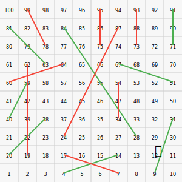

### 🐍 Ular Tangga di Profil GitHub! 🎲

Selamat datang di permainan Ular Tangga interaktif pertama di profil GitHub saya! Pion Anda adalah 🚀.

**Cara Bermain:**
1.  Buka tab **"Issues"** di repositori ini.
2.  Klik **"New Issue"**.
3.  Gunakan judul `Ular Tangga: Lempar Dadu`.
4.  Klik **"Submit new issue"**.
5.  Tunggu sekitar 30 detik, lalu segarkan (refresh) halaman profil ini untuk melihat pion Anda bergerak!

---

**Papan Permainan:**

---

*Game ini ditenagai oleh GitHub Actions. Lihat folder `.github/workflows` untuk melihat cara kerjanya.*
